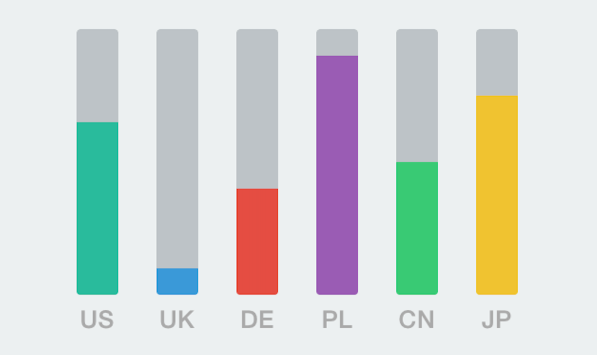
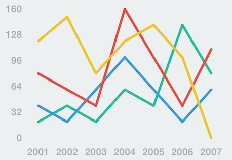

# GraphKit

[](http://twitter.com/michalkonturek)
[](https://github.com/michalkonturek/GraphKit/blob/master/LICENSE)
[](https://github.com/michalkonturek/GraphKit)


A lightweight library of animated charts for iOS. 


## License

Source code of this project is available under the standard MIT license. Please see [the license file][LICENSE].

[PODS]:http://cocoapods.org/
[LICENSE]:https://github.com/michalkonturek/GraphKit/blob/master/LICENSE


## Usage

To see a quick demo, simply type `pod try GraphKit`.

### Bar Graph



Initialize `GKBarGraph` from nib or programmatically:

```objc
CGRect frame = CGRectMake(0, 40, 320, 200);
self.graphView = [[GKBarGraph alloc] initWithFrame:frame];
```

then set `GKGraphViewDataSource` 

```objc
self.graphView.dataSource = self;
```

and call `draw` method.

```objc
[self.graphView draw];
```


Please see [example][BAR].

[BAR]:https://github.com/michalkonturek/GraphKit/blob/master/GraphKit/Example/ExampleBarGraphVC.m


#### `GKBarGraphDataSource` Protocol

```objc
@required
- (NSInteger)numberOfBars;
- (NSNumber *)valueForBarAtIndex:(NSInteger)index;

@optional
- (UIColor *)colorForBarAtIndex:(NSInteger)index;
- (UIColor *)colorForBarBackgroundAtIndex:(NSInteger)index;
- (CFTimeInterval)animationDurationForBarAtIndex:(NSInteger)index;
- (NSString *)titleForBarAtIndex:(NSInteger)index;
```


### Line Graph



```objc
CGRect frame = CGRectMake(0, 40, 320, 200);
self.graphView = [[GKLineGraph alloc] initWithFrame:frame];

self.graph.dataSource = self;
self.graph.lineWidth = 3.0;

[self.graph draw];
```

Please see [example][LINE].

[LINE]:https://github.com/michalkonturek/GraphKit/blob/master/GraphKit/Example/ExampleLineGraph.m


#### `GKLineGraphDataSource` Protocol

```objc
@required
- (NSInteger)numberOfLines;
- (UIColor *)colorForLineAtIndex:(NSInteger)index;
- (NSArray *)valuesForLineAtIndex:(NSInteger)index;

@optional
- (CFTimeInterval)animationDurationForLineAtIndex:(NSInteger)index;
- (NSString *)titleForLineAtIndex:(NSInteger)index;
```

## Contributing

1. Fork it.
2. Create your feature branch (`git checkout -b new-feature`).
3. Commit your changes (`git commit -am 'Added new-feature'`).
4. Push to the branch (`git push origin new-feature`).
5. Create new Pull Request.

